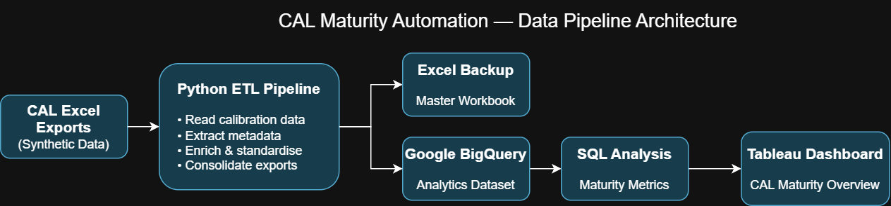
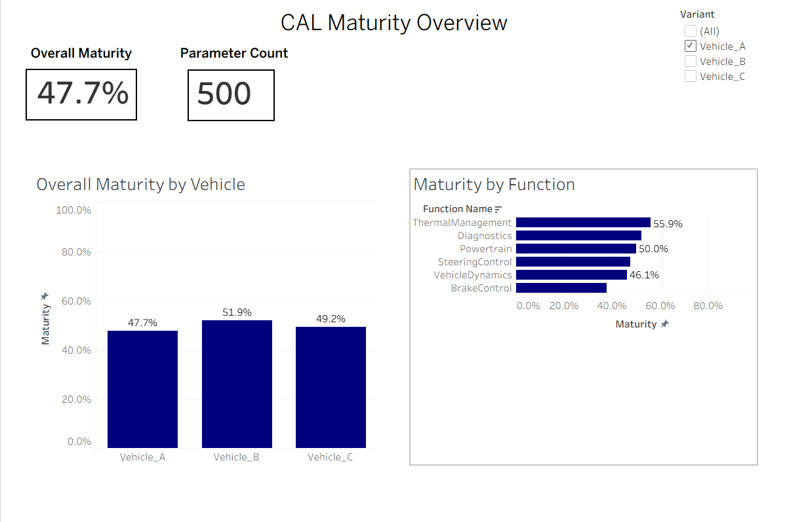

# CAL Maturity Automation

A portfolio reconstruction of an engineering data automation project I contributed to. I demonstrated how Python, Google BigQuery, SQL, and Tableau can all be used to transform calibration data into accessible maturity data.

> This repository uses entirely synthetic data and generic identifiers. It does not contain company data, source files or credentials.

## Overview
Calibration maturity data is often stored in specialist engineering systems and can require engineers to manually inspect individual datasets to understand the maturity of different vehicle programmes.

This project demonstrates an automated data pipeline that consolidates calibration Excel exports, extracts workbook-level metadata, standardises the data using Python, and creates a single analytical dataset. The processed data is written to an Excel backup and uploaded to Google BigQuery, where SQL is used to calculate maturity metrics for visualisation in Tableau.

## Architecture


## Pipeline
The pipeline processes multiple calibration export files and produces a consolidated dataset for downstream analysis.

1. Extract – Reads the calibration table from each Excel export, and separately extracts metadata such as CAL ID, creation date, lead, variant and software version.
2. Transform – Enriches each calibration row with the extracted metadata, standardises it, and converts fields to appropriate data types.
3. Consolidate – Combines the transformed exports into a single master DataFrame.
4. Excel Output – Writes the consolidated dataset to a local master workbook as a backup output.
5. BigQuery Load – Loads the complete dataset into Google BigQuery. (WRITE_TRUNCATE was used to achieve this, as each new run replaces the previous run with new data. )
6. Analysis & Visualisation – SQL queries calculate maturity metrics which are then presented through an interactive Tableau dashboard.

## Dashboard
The consolidated BigQuery dataset is used to provide a high-level view of calibration maturity across vehicle variants and engineering functions. This was something I then used to present to senior management, and those with less technical expertise.

The Tableau dashboard includes:

- Overall calibration maturity
- Total parameter count
- Maturity comparison by vehicle variant
- Function-level maturity analysis
- Interactive filtering by variant



## Skills Demonstrated
- Python – ETL pipeline and data transformation
- pandas – Excel processing, data enrichment and consolidation
- Google BigQuery – Cloud data storage and analytics
- SQL – Maturity metric calculation and analysis
- Tableau – Interactive maturity dashboard
- pytest – Automated unit testing
- Git / GitHub – Version control and project management

## Setup & Usage

1. Clone the repository and install the required Python dependencies:

    ```bash
    pip install -r requirements.txt
    ```

    Create a `.env` file in the project root using `.env.example` as a template:

    ```env
    GCP_PROJECT_ID=your-project-id
    BQ_DATASET_ID=your-dataset-id
    BQ_TABLE_ID=your-table-id
    ```

The `.env` file contains local project configuration and is excluded from version control.

2. Authenticate with Google Cloud using Application Default Credentials:

    ```bash
    gcloud auth application-default login
    ```

This allows the Python BigQuery client to authenticate using your local Google Cloud credentials.

3. Run the ETL pipeline from the project root:

    ```bash
    python -m src.main
    ```

    The pipeline processes the synthetic calibration exports, creates the consolidated Excel master workbook and uploads the resulting dataset to the configured BigQuery table.

